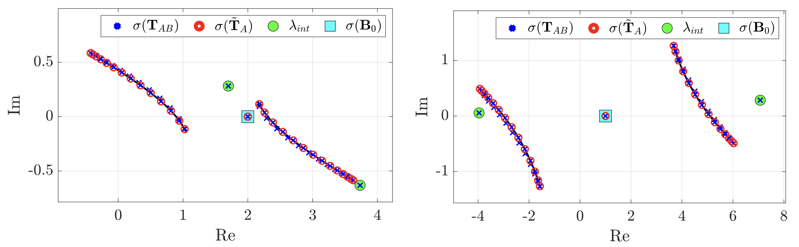
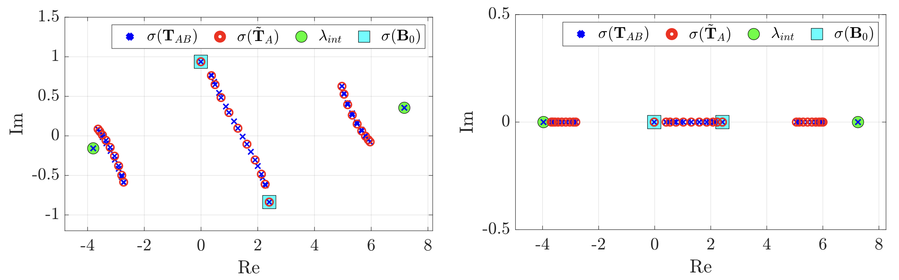
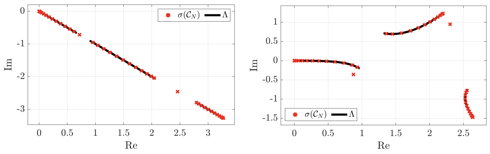
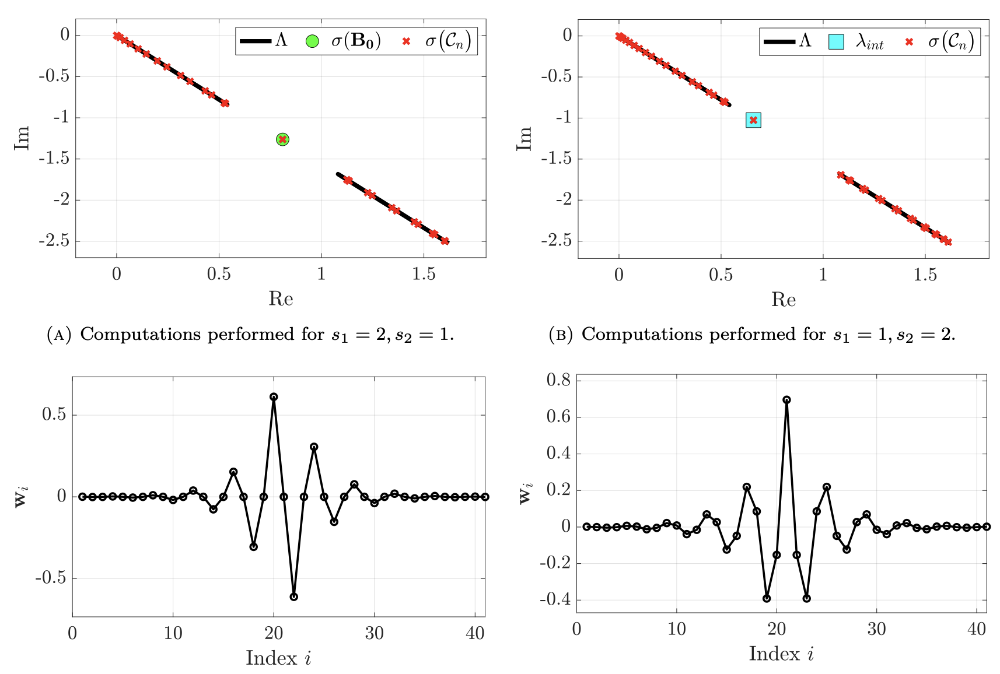
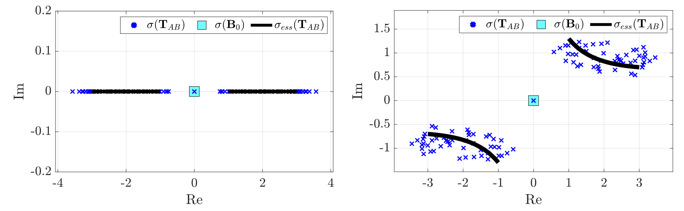
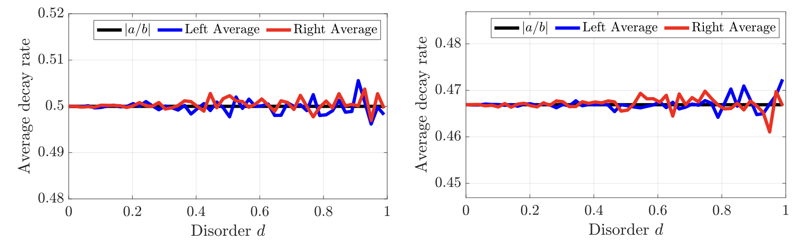

<h1 align="center">Spectra and Topological Interface Modes in Damped Tight-Binding Resonator Chains</h1>

  <b>Y. DE BRUIJN</b> and <b>E. O. HILTUNEN</b> 
  <i>University of Oslo</i> 

  

**Abstract:** We provide the complete computational framework supporting the theoretical results in [1].

  Last updated: March 13, 2026

## II.1 Mirrored Twofold Toeplitz operators

We plot the spectrum of mirrored twofold Toeplitz operators with complex-valued entries.

**Mirrored Dimer twofold Toeplitz** (`TwofoldDimer.m`)  

 
   

**Mirrored Trimer twofold Toeplitz** (`TwofoldTrimer.m`)  

 
   

**Open Limit damped resonator chain** (`DampedDimerChain.m` and `DampedTrimerChain.m`)  

 
   

**Interface modes damped resonator chain** (`DampedDimerChain.m` and `DampedTrimerChain.m`)  

 
   

**Spectrum Disordered Dimer Interface chain** (`DisorderedSpectrumSSH.m`)  

 
   

**Decay rates Disordered Dimer Interface chain** (`DisorderedDecaySSH.m`)  

 
   

  
