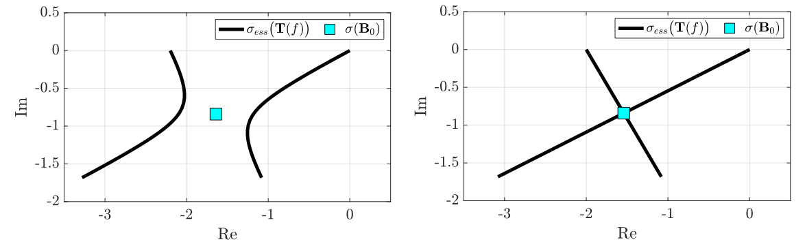
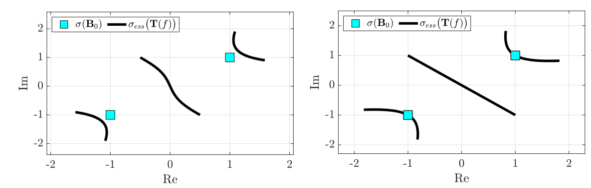
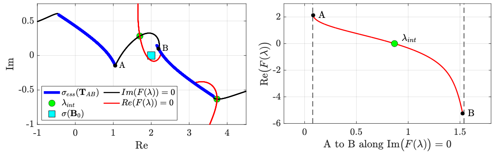
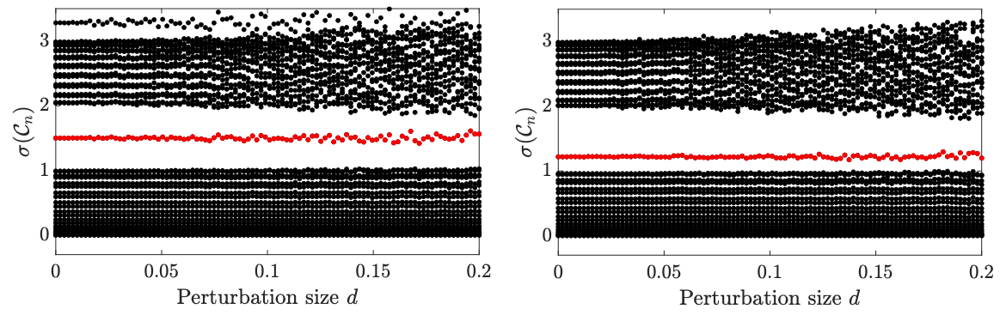

<h1 align="center">Spectra and Topological Interface Modes in Damped Tight-Binding Resonator Chains</h1>

  <b>Y. DE BRUIJN</b> and <b>E. O. HILTUNEN</b> 
  <i>University of Oslo</i> 

  

**Abstract:** We provide the complete computational framework supporting the theoretical results in [1].

  Last updated: March 13, 2026

## I. Topological robustness of edge modes 

**Dimer topologically protected edges modes** (`ComplexDimerTopo.m`) 

 
   

**Dimer topologically protected edges modes** (`ComplexTrimerTopo.m`) 

 
   

## I. Mirrored Twofold Toeplitz operators

We plot the spectrum of mirrored twofold Toeplitz operators with complex-valued entries.

**Mirrored Dimer twofold Toeplitz** (`TwofoldDimer.m`)  

 
   

 
   

**Mirrored Trimer twofold Toeplitz** (`TwofoldTrimer.m`)  

 
   

## II. Damped Resonator chains

**Open Limit damped resonator chain** (`DampedDimerChain.m` and `DampedTrimerChain.m`)  

 
   

**Interface modes damped resonator chain** (`DampedInterfcaeSSH.m`)  

 
   

**Stabiloty of the interface mode under perturbations** (`NoisySSH.m`)  

 
   

## III. Disorder Damped Interface SSH

**Spectrum Disordered Dimer Interface chain** (`DisorderedSpectrumSSH.m`)  

 
   

**Decay rates Disordered Dimer Interface chain** (`DisorderedDecaySSH.m`)  

 
   

## IV. Citation

If you use this code in your research, please cite:

> de Bruijn, Y.and Hiltunen, E.O., *Topologically protected interface modes in multi-banded damped lattice models* (2026)

